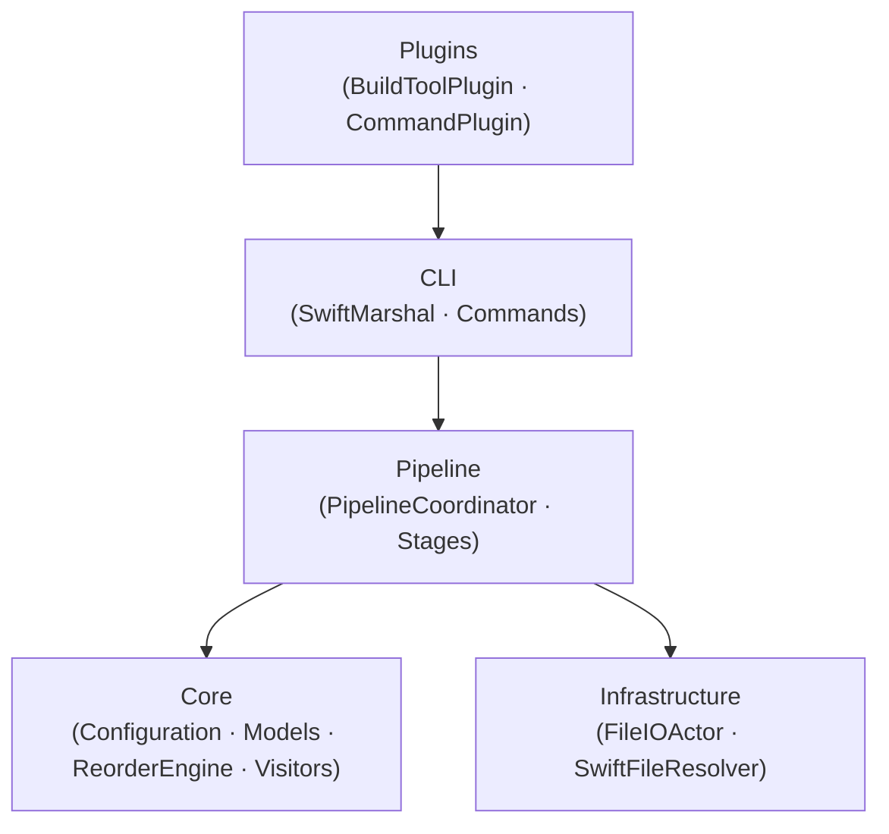

# Overview

← [Index](README.md) | Next: [Pipeline →](02-pipeline.md)

---

## Purpose

`swift-marshal` enforces a **consistent member ordering** within Swift type declarations — structs, classes, enums, actors, and protocols. It reads the declaration order defined in a configuration file and either reports violations (`check`) or rewrites source files to comply (`fix`).

## Module Map

The codebase is organized into four independent layers. Each has a single responsibility and communicates through well-defined value types.



| Layer | Responsibility |
|---|---|
| **CLI** | Argument parsing, command routing, exit codes |
| **Pipeline** | Stage orchestration, concurrent file processing |
| **Core** | Domain models, configuration, reordering logic, AST visitors |
| **Infrastructure** | File I/O, Swift file discovery |
| **Plugins** | SPM and Xcode integration |

## Entry Point

`SwiftMarshal.swift` is the `@main` entry point. It routes each invocation to the appropriate command handler.

```mermaid
flowchart TD
    A[Parse CLI arguments] --> B{Subcommand?}
    B -- check --> C[CheckCommand.run]
    B -- fix --> D[FixCommand.run]
    B -- init --> E[InitCommand.run]
    B -- --version --> F[Print version]
    B -- --help / empty --> G[Print usage]
    C --> H{Violations?}
    H -- yes, strict --> I[Exit 1]
    H -- no --> J[Exit 0]
    D --> K{Changes written?}
    K --> J
```

## Plugins

Two SPM plugins are provided for Xcode and CI integration.

**SwiftMarshalPlugin** (`BuildToolPlugin`) — runs automatically during each build. Because SPM build plugins operate in a sandbox, this plugin runs `check` in read-only mode and surfaces violations as Xcode build warnings using the `--xcode` flag.

**SwiftMarshalCommandPlugin** (`CommandPlugin`) — invoked explicitly from Xcode's *Product → swift-marshal* menu or via `swift package swift-marshal`. This plugin has write access and runs `fix`, applying member reordering directly to source files.

---

← [Index](README.md) | Next: [Pipeline →](02-pipeline.md)
