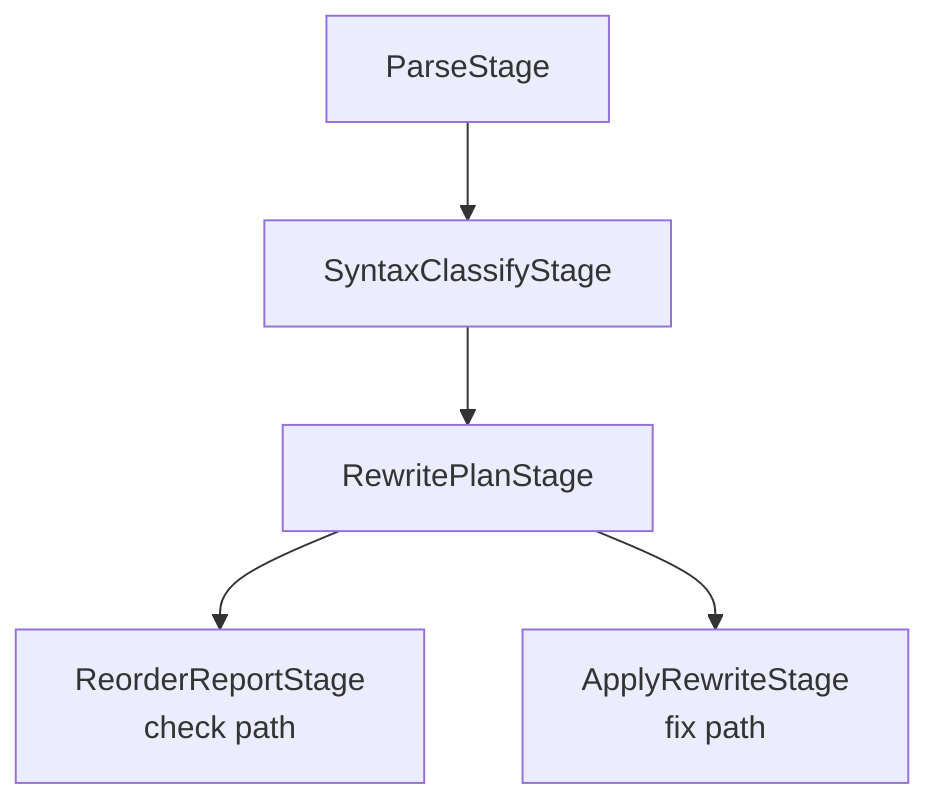
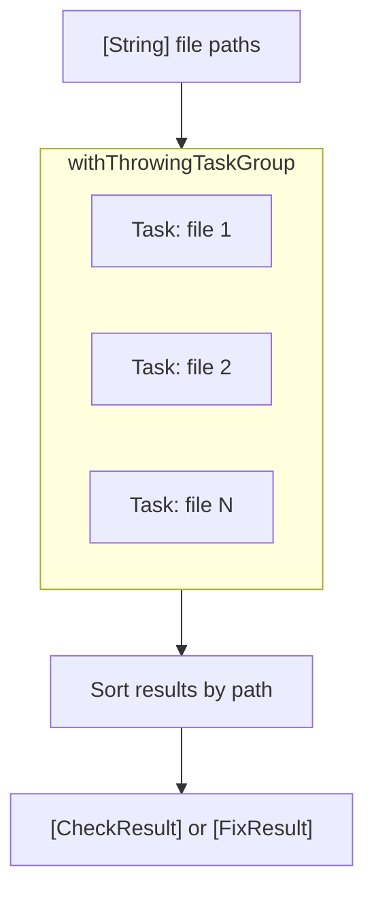

# Pipeline

← [Overview](01-overview.md) | Next: [Configuration →](03-configuration.md)

---

## Design

The pipeline follows the **Pipe and Filter** pattern. Each stage is a stateless, pure transformation: it receives an immutable input, produces an immutable output, and has no side effects. Stages compose via a generic `Pipeline<S1, S2>` type that implements the same `Stage` protocol.

```swift
protocol Stage<Input, Output>: Sendable {
    func process(_ input: Input) throws -> Output
}
```

Any two compatible stages can be chained with `.then()`, producing a new stage that the compiler treats as a single unit.

## Stages

Both `check` and `fix` share the first three stages. They diverge only at the output step.



### ParseStage

Reads a Swift source file and builds a SwiftSyntax AST.

| | |
|---|---|
| Input | `ParseInput` — file path + source text |
| Output | `ParseOutput` — syntax tree + `SourceLocationConverter` |

### SyntaxClassifyStage

Walks the AST and collects every type declaration and its members, retaining the original syntax nodes for later rewriting.

| | |
|---|---|
| Input | `ParseOutput` |
| Output | `SyntaxClassifyOutput` — syntax tree + `[SyntaxTypeDeclaration]` |

Each `SyntaxTypeDeclaration` holds a `[SyntaxMemberDeclaration]`, where each member pairs a semantic `MemberDeclaration` (name, kind, visibility) with its `MemberBlockItemSyntax` node.

### RewritePlanStage

Applies the ordering rules to each type and builds a rewrite plan without touching the source.

| | |
|---|---|
| Input | `SyntaxClassifyOutput` |
| Output | `RewritePlanOutput` — syntax tree + `[TypeRewritePlan]` |

For each type, `ReorderEngine` determines the target member order. The stage then maps reordered declarations back to their original syntax nodes and records the index permutation as a `[IndexedSyntaxMember]`.

### ApplyRewriteStage *(fix only)*

Executes the rewrite plans against the syntax tree and serialises the result back to text.

| | |
|---|---|
| Input | `RewritePlanOutput` |
| Output | `RewriteOutput` — rewritten source text + `modified` flag |

Uses `MemberReorderingRewriter` — a `SyntaxRewriter` subclass — to physically move `MemberBlockItemSyntax` nodes according to each plan. Blank lines and leading trivia are normalised during the move.

### ReorderReportStage *(check only)*

Formats the rewrite plans as a human-readable report for CLI output.

| | |
|---|---|
| Input | `ReorderOutput` — results derived from `[TypeRewritePlan]` |
| Output | `ReportOutput` — formatted text + declaration count |

## Coordinator

`PipelineCoordinator` is an `actor` that builds the pipeline and processes files concurrently.



Each task processes one file through the full pipeline independently. File I/O is delegated to `FileIOActor` to keep reads and writes actor-isolated.

## Concurrency Model

| Component | Model |
|---|---|
| `PipelineCoordinator` | `actor` — isolates pipeline state and result collection |
| File processing | `withThrowingTaskGroup` — one task per file |
| `FileIOActor` | `actor` — serialises file reads and writes |
| Pipeline stages | Stateless `struct` values — no synchronisation needed |
| All data types | `Sendable` — safe to cross actor boundaries |

---

← [Overview](01-overview.md) | Next: [Configuration →](03-configuration.md)
