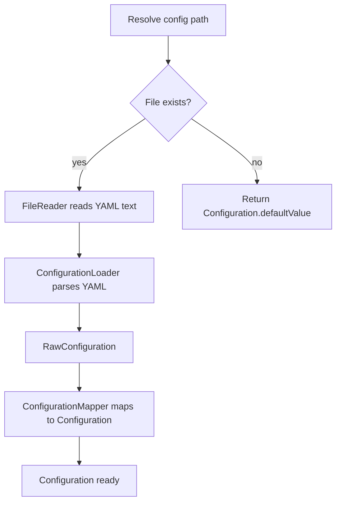

# Configuration

← [Pipeline](02-pipeline.md) | Next: [Classification & Rewriting →](04-classification-rewriting.md)

---

## Configuration File

`swift-marshal` reads a `.swift-marshal.yaml` file. `ConfigurationService` searches for it by walking up from the target directory. If none is found, the built-in defaults apply.

`swift-marshal init` generates a starter file in the current directory.

```yaml
version: 1

ordering:
  members:
    - typealias
    - associatedtype
    - initializer
    - type_property
    - instance_property
    - subtype
    - type_method
    - instance_method
    - subscript
    - deinitializer

extensions:
  strategy: separate
  respect_boundaries: true

paths:
  - Sources/
```

## Configuration Model

```
Configuration
├── version              — config schema version
├── memberOrderingRules  — ordered list of MemberOrderingRule
├── extensionsStrategy   — separate | inline
├── respectBoundaries    — honour MARK comment boundaries
└── paths                — directories to scan when no files are passed
```

## Ordering Rules

Rules are evaluated from most specific to least specific. A member is assigned to the first rule that matches it.

### Simple rules

Match by member kind only.

```yaml
ordering:
  members:
    - initializer
    - instance_property
    - instance_method
```

### Complex rules

Match by kind plus additional constraints. Members not matching a complex rule fall through to the next rule.

```yaml
ordering:
  members:
    - property:
        visibility: public
    - property:
        visibility: private
    - method:
        kind: static
        visibility: internal
```

## Loading Pipeline

`ConfigurationService` orchestrates loading in three steps.



## Default Member Order

When no configuration file is present, members are ordered as follows:

| Position | Kind |
|---|---|
| 1 | Type alias |
| 2 | Associated type |
| 3 | Initializer |
| 4 | Type property |
| 5 | Instance property |
| 6 | Subtype |
| 7 | Type method |
| 8 | Instance method |
| 9 | Subscript |
| 10 | Deinitializer |

---

← [Pipeline](02-pipeline.md) | Next: [Classification & Rewriting →](04-classification-rewriting.md)
