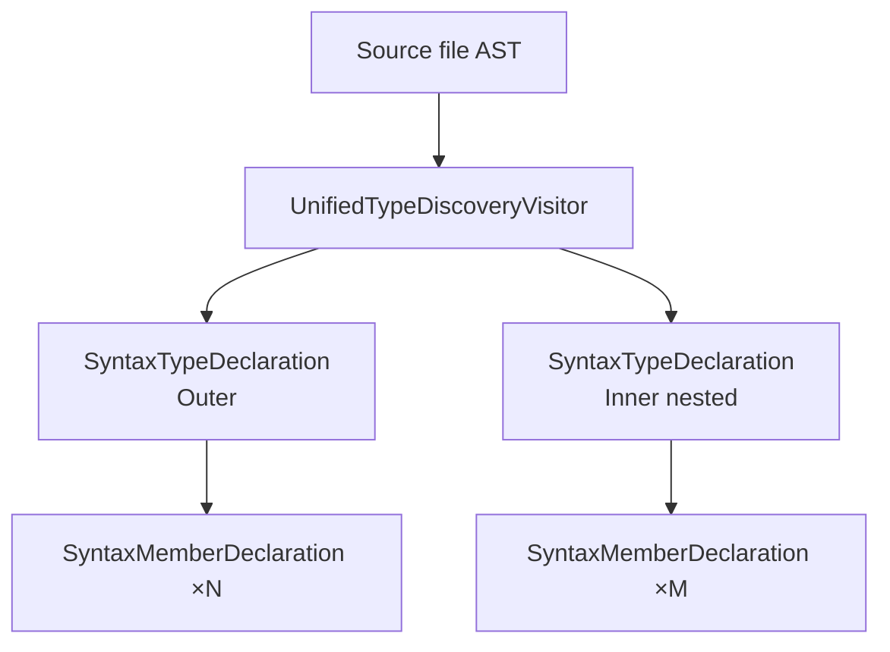
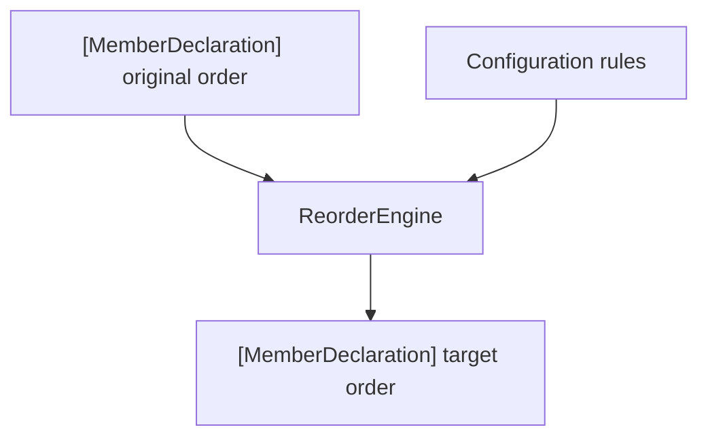
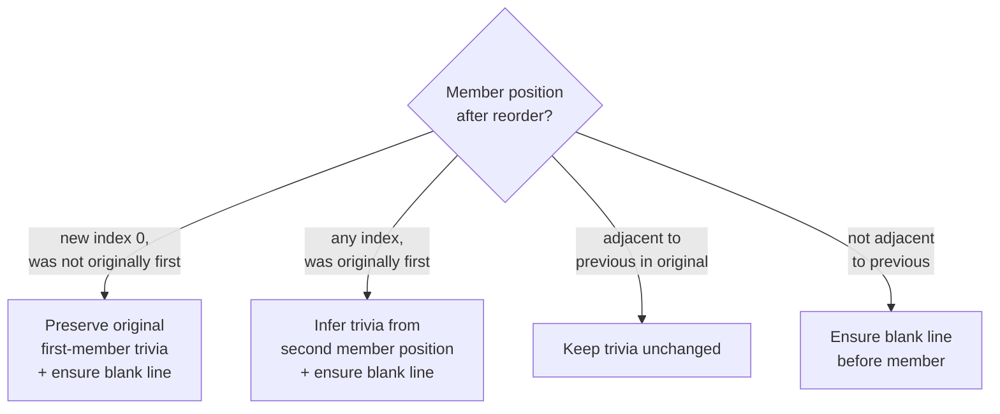

# Classification & Rewriting

← [Configuration](03-configuration.md) | [Index →](README.md)

---

## Type Discovery

`SyntaxClassifyStage` uses `UnifiedTypeDiscoveryVisitor` to walk the SwiftSyntax tree and collect every type declaration. The visitor visits structs, classes, enums, actors, and protocols at any nesting depth.



For each type, a nested `UnifiedMemberDiscoveryVisitor` scans the `MemberBlock` and records each direct member. Nested type declarations are recorded as `.subtype` members — they are not recursed into at the member level (the outer type visitor handles them separately).

## Member Classification

Every member is classified by kind and visibility.

### Member Kinds

| Kind | Declaration |
|---|---|
| `typeAlias` | `typealias` |
| `associatedType` | `associatedtype` |
| `initializer` | `init` |
| `deinitializer` | `deinit` |
| `typeProperty` | `static var` / `class var` |
| `instanceProperty` | `var` / `let` (instance) |
| `typeMethod` | `static func` / `class func` |
| `instanceMethod` | `func` (instance) |
| `subscriptMember` | `subscript` |
| `subtype` | Nested type declaration |

### Visibility

`open · public · internal · fileprivate · private`

Members without an explicit modifier are treated as `internal`.

## Data Structures

```
SyntaxTypeDeclaration
├── name         — type name (e.g. "UserService")
├── kind         — TypeKind (struct, class, enum, actor, protocol)
├── line         — declaration line number
├── members      — [SyntaxMemberDeclaration]
└── memberBlock  — MemberBlockSyntax (syntax node for rewriting)

SyntaxMemberDeclaration
├── declaration  — MemberDeclaration (name, kind, line, visibility, isAnnotated)
└── syntax       — MemberBlockItemSyntax (original syntax node)
```

`SyntaxMemberDeclaration` bridges the semantic layer (`MemberDeclaration`) with the syntax layer (`MemberBlockItemSyntax`). The semantic side drives reordering decisions; the syntax side drives the actual AST mutation.

## Reordering

`ReorderEngine` receives a `[MemberDeclaration]` and returns them in the order defined by the active configuration rules. It is a pure function — no state, no I/O.



`RewritePlanStage` maps the reordered declarations back to their original syntax nodes by name, producing a `[IndexedSyntaxMember]` that records each member's new position alongside its `originalIndex`.

## AST Rewriting

`MemberReorderingRewriter` applies the plans to the live syntax tree. It is a `SyntaxRewriter` subclass that visits each type declaration, finds the matching plan, and returns a new node with members in the target order.

### Plan Matching

For each type node visited, the rewriter looks for a matching plan:

1. **By syntax node identity** — checks if node IDs match exactly (same parse)
2. **By member count** — fallback when IDs differ (e.g. re-parsed source)
3. **No match** — node returned unchanged

### Trivia Normalisation

Reordering members can disturb leading whitespace. The rewriter applies three rules to keep formatting consistent:



Two members are considered **adjacent** when `originalIndex == previousOriginalIndex + 1`, meaning they were consecutive in the original source. Non-adjacent moves always get a blank line separator.

---

← [Configuration](03-configuration.md) | [Index →](README.md)
