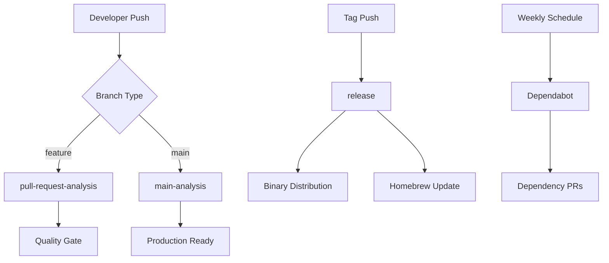
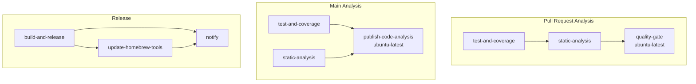
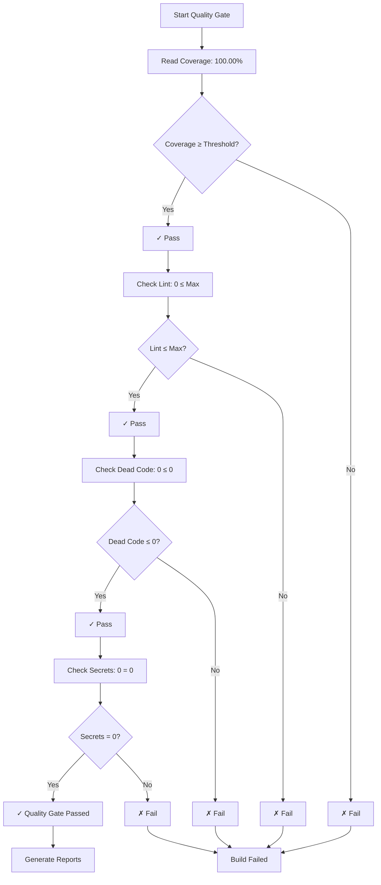
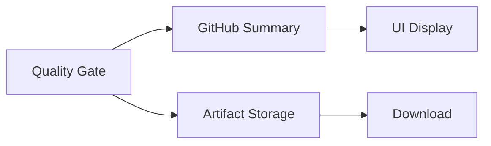
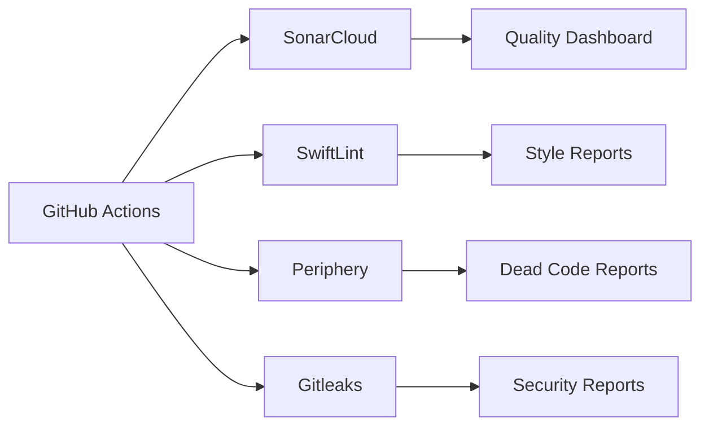
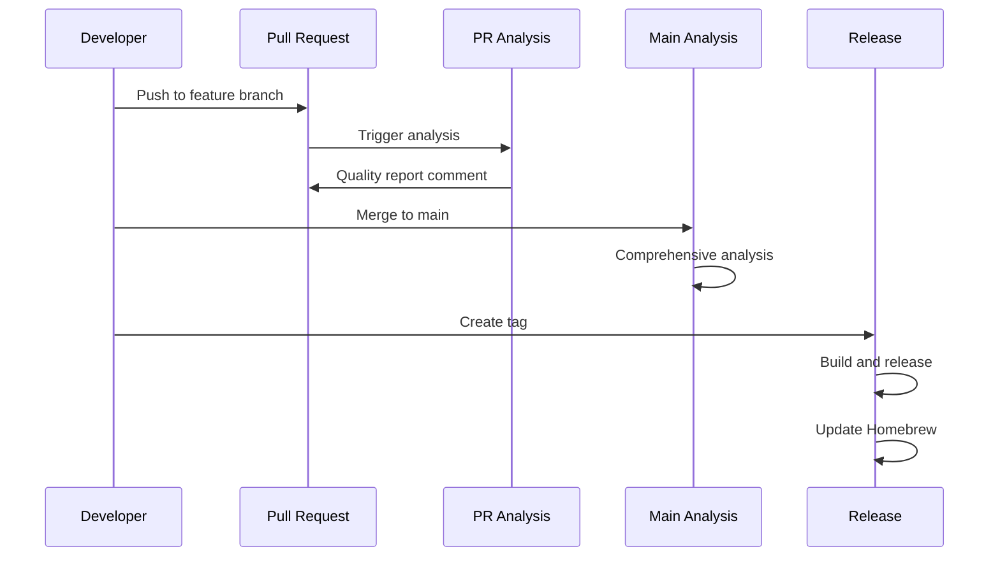

# CI/CD Documentation

## Overview

This document describes the continuous integration and deployment processes implemented in the Swift Marshal project using GitHub Actions.

## Workflows

### 1. Pull Request Analysis (`pull-request-analysis.yml`)

Quality analysis workflow that runs on every pull request targeting main.

**Documentation:** [pull-request-analysis.md](pull-request-analysis.md)

**Purpose:**
- **Fast Feedback**: Quick quality checks on PR changes
- **Quality Gate**: Enforce coverage and security thresholds
- **PR Comments**: Automatic quality reports on PRs

**Triggers:**
- Pull requests to `main` (opened, synchronize, reopened)

### 2. Main Analysis (`main-analysis.yml`)

Comprehensive workflow that runs on pushes to the main branch for production readiness.

**Documentation:** [main-analysis.md](main-analysis.md)

**Purpose:**
- **Production Readiness**: Ensure main branch is always releasable
- **Comprehensive Analysis**: Complete codebase analysis
- **Trend Analysis**: Track quality metrics over time
- **Release Preparation**: Generate release artifacts

**Key Metrics:**
- **Coverage**: 100.00% (Lines) - Target: ≥98%
- **Security**: 0 issues - Target: 0
- **Code Quality**: ≤5 violations - Target: ≤5
- **Documentation**: 85% coverage - Target: ≥80%

### 3. Release (`release.yml`)

Automated workflow for building and releasing Swift Marshal binaries.

**Documentation:** [release.md](release.md)

**Purpose:**
- **Binary Distribution**: Build and package release-ready binaries
- **GitHub Releases**: Create automated releases with artifacts
- **Homebrew Integration**: Update Homebrew Tap formula automatically
- **Artifact Management**: Generate SHA256 checksums and proper release artifacts

**Triggers:**
- **Automatic**: Tag pushes matching `v*` pattern
- **Manual**: On-demand with version input

### 4. Dependabot

Automated dependency updates for Swift packages and GitHub Actions.

**Documentation:** [dependabot.md](dependabot.md)

**Purpose:**
- **Swift Dependencies**: Weekly updates (minor/patch only)
- **GitHub Actions**: Weekly updates (grouped)
- **Security**: Keep dependencies current

**Schedule:** Weekly on Sundays at 03:00 (America/Sao_Paulo)

## Workflow Architecture

### Overall Flow



### Job Dependencies



## Quality Metrics

### Coverage Types

| Type | Description | Target | Current |
|------|-------------|--------|---------|
| **Lines Coverage** | Lines of code executed | ≥98% | 100.00% |
| **Regions Coverage** | Blocks of executable code | - | 99.28% |
| **Functions Coverage** | Functions called | - | 100.00% |

### Static Analysis Metrics

| Tool | Purpose | Threshold | Current |
|------|---------|-----------|---------|
| **SwiftLint** | Code style and conventions | ≤5 violations | 0 |
| **Periphery** | Dead code detection | ≤0 findings | 0 |
| **Gitleaks** | Secret detection | 0 findings | 0 |

### Quality Gate Logic



## Artifacts and Reports

### Generated Artifacts

| Artifact | Content | Purpose | Consumers |
|----------|---------|---------|-----------|
| **coverage/lcov.info** | LCOV format coverage data | SonarQube integration | Quality Gate |
| **coverage/lines-percent.txt** | Lines coverage percentage | Quality gate calculation | Quality Gate |
| **reports/swiftlint.json** | SwiftLint findings | Style analysis | Quality Gate |
| **reports/periphery.json** | Dead code findings | Code cleanup | Quality Gate |
| **reports/gitleaks.sarif** | Security findings | Security audit | Quality Gate |

### Report Distribution



## Configuration

### Environment Variables

| Variable | Description | Default |
|----------|-------------|---------|
| `COVERAGE_THRESHOLD` | Minimum coverage percentage | 98% |
| `MAX_LINT_VIOLATIONS` | Maximum allowed lint violations | 5 |
| `MAX_DEAD_CODE` | Maximum allowed dead code findings | 0 |
| `FAIL_ON_SECRETS` | Fail build on secrets found | true |

### Repository Variables

Configure these in GitHub repository Settings → Secrets and variables → Actions:

```yaml
# Repository Variables
COVERAGE_THRESHOLD: 98
MAX_LINT_VIOLATIONS: 5
MAX_DEAD_CODE: 0
FAIL_ON_SECRETS: true

# Required Secrets
SONAR_TOKEN: # For SonarCloud analysis
GITHUB_TOKEN: # Built-in, no setup needed
```

## Performance Metrics

### Execution Time

| Workflow | Average Time | Optimization |
|----------|--------------|--------------|
| **Pull Request Analysis** | 8-14 minutes | Fast feedback |
| **Main Analysis** | 30-47 minutes | Comprehensive analysis |
| **Release** | 10-15 minutes | Binary build and distribution |

### Resource Usage

**Runner Requirements:**

| Workflow | Jobs on macOS | Jobs on Linux |
|----------|---------------|---------------|
| **Pull Request Analysis** | `test-and-coverage`, `static-analysis` | `quality-gate` |
| **Main Analysis** | `test-and-coverage`, `static-analysis` | `publish-code-analysis` |
| **Release** | `build-and-release` | `update-homebrew-tools`, `notify` |

**Cost Optimization**: Jobs that only process artifacts (publishing, notifications) run on cheaper Linux runners.

## Integration Points

### External Services



### Data Flow



## Troubleshooting

### Common Issues

#### Coverage Issues
- **Empty Coverage**: Check `lines-percent.txt` generation
- **Incorrect Value**: Ensure using Lines Coverage
- **File Not Found**: Verify artifact upload/download

#### Quality Gate Failures
- **Threshold Issues**: Check repository variables
- **Tool Failures**: Verify tool installations
- **Report Parsing**: Check JSON format validity

#### Performance Issues
- **Slow Builds**: Check cache effectiveness
- **Timeout Issues**: Increase timeout values
- **Resource Limits**: Monitor runner usage

### Debug Mode

Enable debug output by checking workflow logs for:
```
 DEBUG: Lines Coverage from file = 100.00%
 DEBUG: LINT_COUNT=0, DEAD_CODE_COUNT=0, SECRETS_COUNT=0
 DEBUG: FAIL=0
```

## Best Practices

### Workflow Optimization

1. **Use Artifacts**: Share data efficiently between jobs
2. **Cache Dependencies**: Speed up build times
3. **Parallel Execution**: Run independent jobs simultaneously
4. **Graceful Failures**: Continue analysis despite individual tool failures

### Quality Standards

1. **High Coverage**: Target 100% lines coverage
2. **Zero Tolerance**: No secrets or critical issues
3. **Clean Code**: Minimize lint violations and dead code
4. **Fast Feedback**: Provide quick, actionable feedback

### Maintenance

1. **Regular Updates**: Keep tools and actions current
2. **Threshold Review**: Adjust quality targets as needed
3. **Performance Monitoring**: Track execution times and success rates
4. **Documentation**: Keep configuration and processes documented

## Documentation Structure

```
Docs/CI/
├── README.md                  # This file - Overview
├── pull-request-analysis.md   # PR workflow details
├── main-analysis.md           # Main branch workflow details
├── release.md                 # Release workflow details
├── dependabot.md              # Dependabot configuration
└── homebrew-tools-setup.md    # Homebrew Tap configuration guide
```

## Quick Start

### For New Team Members

1. **Understand Workflows**: Review workflow documentation
2. **Check Quality Standards**: Review current metrics and thresholds
3. **Review Real Workflows**: Check `.github/workflows/` directory

### For Maintainers

1. **Monitor Performance**: Track execution times and success rates
2. **Update Configurations**: Adjust thresholds and rules as needed
3. **Review Real Code**: Check actual workflow implementations

### For Contributors

1. **Understand Quality Gates**: Know what blocks merges
2. **Review Reports**: Understand feedback from automated analysis
3. **Follow Standards**: Adhere to coding and quality standards

This documentation provides a comprehensive guide to the CI/CD processes in the Swift Marshal project.
