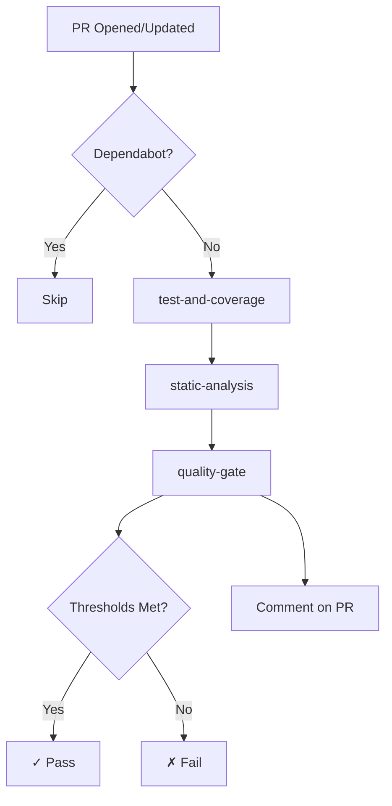

# Pull Request Analysis Workflow

**Source**: `.github/workflows/pull-request-analysis.yml`

## Overview

Automated quality analysis workflow that runs on every pull request targeting the main branch. Provides fast feedback on code quality, test coverage, and security.

## Triggers

- Pull requests to `main` branch
- Events: `opened`, `synchronize`, `reopened`
- Skipped for Dependabot PRs (handled separately)

## Jobs

### 1. test-and-coverage

**Runner**: `macos-26`
**Timeout**: 30 minutes

Builds the project and runs tests with code coverage.

**Steps**:
1. Checkout repository
2. Setup Swift 6.2.3
3. Cache SwiftPM dependencies
4. Run tests with coverage enabled
5. Generate LCOV coverage report
6. Extract lines coverage percentage
7. Upload coverage artifacts

**Artifacts produced**:
- `coverage/lcov.info` - LCOV format coverage data
- `coverage/lines-percent.txt` - Lines coverage percentage

### 2. static-analysis

**Runner**: `macos-26`
**Depends on**: `test-and-coverage`

Runs static analysis tools to check code quality.

**Tools**:
| Tool | Purpose | Output |
|------|---------|--------|
| SwiftLint | Code style and conventions | `reports/swiftlint.json` |
| Periphery | Dead code detection | `reports/periphery.json` |
| Gitleaks | Secret detection | `reports/gitleaks.sarif` |
| jscpd | Code duplication detection | `reports/jscpd-report.json` |

**jscpd Configuration**:
- Minimum lines: 10
- Minimum tokens: 50
- Format: Swift

### 3. quality-gate

**Runner**: `ubuntu-latest`
**Depends on**: `test-and-coverage`, `static-analysis`

Evaluates quality metrics and posts results to the PR.

**Thresholds** (configurable via repository variables):

| Metric | Default | Variable |
|--------|---------|----------|
| Coverage | 95% | `COVERAGE_THRESHOLD` |
| Max duplication | 5% | `MAX_DUPLICATION` |
| Max lint violations | 10 | `MAX_LINT_VIOLATIONS` |
| Max dead code | 0 | `MAX_DEAD_CODE` |
| Fail on secrets | true | `FAIL_ON_SECRETS` |
| Strict mode | false | `STRICT_MODE` |

**Actions**:
1. Download coverage and reports artifacts
2. Evaluate metrics against thresholds
3. Generate quality report
4. Post report to GitHub Step Summary
5. Comment on PR with results
6. Fail workflow if thresholds not met

## Quality Report

The workflow posts a comment on the PR with a quality report:

```markdown
## Pull Request Quality Report

| Metric | Value | Status | Threshold |
|--------|-------|--------|----------|
| Coverage | 98.5% | ✓ | >= 95% |
| Code duplication | 2.1% (3 clones) | ✓ | <= 5% |
| Linter violations | 2 | ~ | <= 10 |
| Dead code | 0 | ~ | <= 0 |
| Secrets | 0 | ✓ | 0 |

Strict mode: false
```

## Configuration

### Repository Variables

Set these in Settings → Secrets and variables → Actions → Variables:

```yaml
COVERAGE_THRESHOLD: 95      # Minimum coverage percentage
MAX_DUPLICATION: 5          # Maximum allowed code duplication percentage
MAX_LINT_VIOLATIONS: 10     # Maximum allowed lint issues
MAX_DEAD_CODE: 0            # Maximum allowed dead code findings
FAIL_ON_SECRETS: true       # Fail if secrets detected
STRICT_MODE: false          # Enforce lint, dead code and duplication limits
```

### Strict Mode

When `STRICT_MODE` is `true`:
- Lint violations above threshold fail the build
- Dead code above threshold fails the build
- Code duplication above threshold fails the build

When `STRICT_MODE` is `false`:
- Only coverage and secrets are enforced
- Lint, dead code and duplication are reported but don't fail

## Workflow Diagram



## Related Documentation

- [Main Analysis](main-analysis.md) - Production branch analysis
- [Release](release.md) - Release workflow
