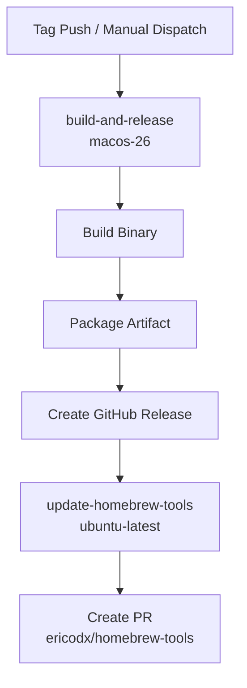

# Release Workflow Documentation

## Overview

The `release` workflow automates the release process for Swift Marshal: build the binary, create a GitHub release, and open a PR to update the Homebrew Tap.

## Trigger Configuration

```yaml
on:
  push:
    tags:
      - "v*"
  workflow_dispatch:
    inputs:
      version:
        description: 'Release version (e.g., 1.0.0)'
        required: true
```

**Trigger Events:**
- `push`: Tag push matching `v*` pattern
- `workflow_dispatch`: Manual trigger with version input

## Workflow Architecture



## Jobs

### 1. build-and-release

**Environment**: `macos-26` with Swift 6.2.3

**Steps:**
1. Checkout repository
2. Setup Swift
3. Determine version (add `v` prefix if missing)
4. Inject version into `Version.swift`
5. Build release binary
6. Package artifact (`.tar.gz`)
7. Create GitHub Release with auto-generated release notes

**Outputs:**
- `version`: e.g., `v1.0.0`
- `artifact_name`: e.g., `swift-marshal-v1.0.0-macos.tar.gz`

### 2. update-homebrew-tools

**Environment**: `ubuntu-latest`

**Action**: `mislav/bump-homebrew-formula-action@v3`

**Steps:**
1. Download release artifact and calculate SHA256
2. Create branch in Homebrew Tap repository
3. Update formula with new version, URL, and SHA256
4. Open Pull Request

## Secrets Required

| Secret | Purpose |
|--------|---------|
| `GITHUB_TOKEN` | Release creation (built-in) |
| `HOMEBREW_TOOLS_GITHUB_TOKEN` | Homebrew Tap PR creation |

**First time setup?** See [Homebrew Tap Setup](homebrew-tools-setup.md) for complete configuration instructions.

## Version Injection

The CLI version is dynamically injected during the release build:

```yaml
- name: Inject version
  run: |
    VERSION="${{ steps.version.outputs.version }}"
    VERSION="${VERSION#v}"  # Remove 'v' prefix
    echo "enum Version { static let current = \"$VERSION\" }" > Sources/SwiftMarshal/Version.swift
```

| Context | `--version` Output |
|---------|-------------------|
| Development | `0.0.0-dev` |
| Release binary | `1.2.3` |

See [CLI/Version](../CLI/Version.md) for more details.

## Release Process

### Via Tag Push
```bash
git tag v1.0.0
git push origin v1.0.0
```

### Via Manual Dispatch
1. Go to Actions → release → Run workflow
2. Enter version (e.g., `1.0.0`)

### Post-Release
1. Review and merge the PR in `ericodx/homebrew-tools`
2. Users can install: `brew install ericodx/tap/swift-marshal`

## Troubleshooting

**Build Failures**: Check Swift version compatibility.

**Homebrew PR Failures**: Verify `HOMEBREW_TOOLS_GITHUB_TOKEN` has correct permissions.

**Release not created**: Ensure tag format is `v1.2.3`.
