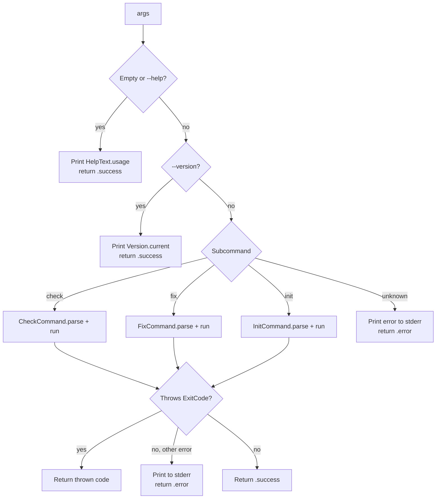

# Entry Point

[Index](README.md) | Next: [Commands →](02-commands.md)

---

## SwiftMarshal

`SwiftMarshal.swift` — `@main` entry point.

```swift
@main
struct SwiftMarshal {
    static func main() async
    static func run(args: [String]) async -> ExitCode
}
```

`main()` strips the process name from `CommandLine.arguments` and passes the remainder to `run(args:)`, then calls `exit(_:)` with the returned code.

`run(args:)` handles three special cases before routing to a subcommand:



Errors that conform to `ExitCode` propagate the specific exit code. All other thrown errors print to `stderr` and return `.error`.

---

## ExitCode

`CLI/ExitCode.swift`

```swift
struct ExitCode: Error, Sendable {
    let rawValue: Int32
    init(_ rawValue: Int32)

    static let success = ExitCode(0)
    static let error   = ExitCode(2)
}
```

Commands throw `ExitCode(1)` directly to signal violations without printing an error message.

| Value | Meaning |
|---|---|
| `0` | Success |
| `1` | Violations found (`check`) / changes needed (`fix --dry-run`) |
| `2` | Unrecoverable error |

---

## HelpText

`CLI/HelpText.swift`

```swift
enum HelpText {
    static let usage: String
}
```

A static string rendered verbatim to stdout when the user passes `--help`, `-h`, or no arguments.

---

## Version

`Version.swift`

```swift
enum Version {
    static let current: String
}
```

Single static string containing the current tool version, printed for `--version`.

---

## ArgumentParsingError

`CLI/ArgumentParsingError.swift`

```swift
enum ArgumentParsingError: Error, LocalizedError {
    case unknownFlag(String)
    case missingValue(String)
}
```

Thrown by `parseArguments(_:options:handle:)` when argument parsing fails.

| Case | Trigger |
|---|---|
| `.unknownFlag(flag)` | An unrecognised `-` prefixed token |
| `.missingValue(flag)` | A value-taking flag with nothing following it |

---

## ValidationError

`CLI/ValidationError.swift`

```swift
struct ValidationError: Error, LocalizedError, Sendable {
    init(_ message: String)
    var errorDescription: String? { get }
}
```

Wraps a plain message string. Thrown when a command cannot proceed (e.g. no Swift files found).

---

[Index](README.md) | Next: [Commands →](02-commands.md)
