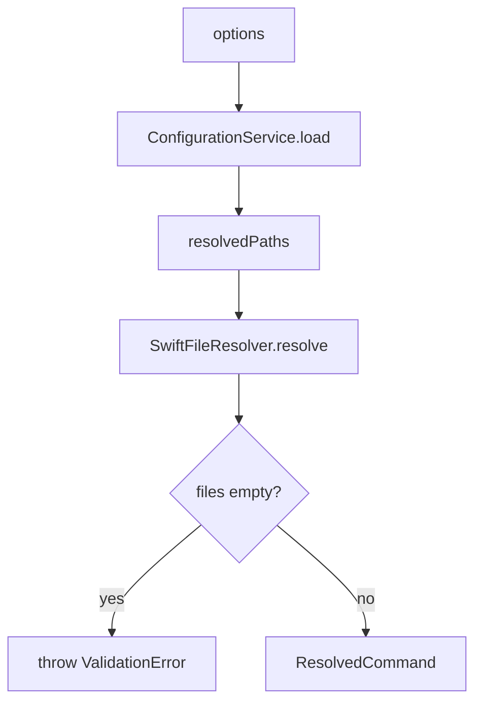
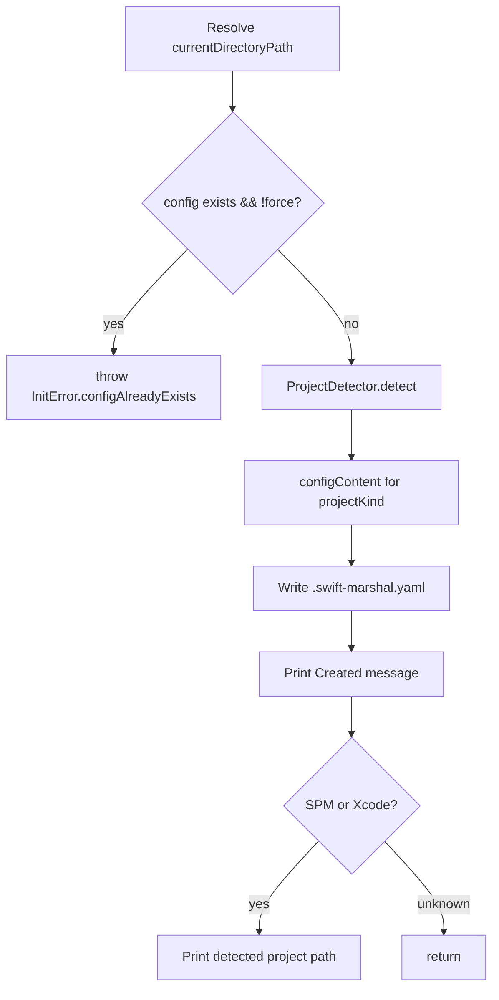

# Commands

← [Entry Point](01-entry-point.md) | Next: [Pipeline →](03-pipeline.md)

---

## CommonCommandOptions

`Commands/CommonCommandOptions.swift`

Shared flags available on every command that processes files.

```swift
struct CommonCommandOptions {
    var files:  [String] = []
    var path:   String?  = nil
    var config: String?  = nil
    var quiet:  Bool     = false
}
```

| Field | Flag | Description |
|---|---|---|
| `files` | positional | Explicit file paths to process |
| `path` | `--path` / `-p` | Directory to scan for Swift files |
| `config` | `--config` / `-c` | Path to a `.swift-marshal.yaml` file |
| `quiet` | `--quiet` / `-q` | Suppress per-file output |

---

## Shared Parsing Helpers

`Commands/CommandParsing.swift`

Three free functions used by all commands.

### parseArguments

```swift
func parseArguments(
    _ args: [String],
    options: inout CommonCommandOptions,
    handle: (String, inout Int) throws -> Bool
) throws
```

Iterates `args`, resolves shared flags into `options`, and delegates unknown flags to `handle`. Positional arguments (no `-` prefix) are appended to `options.files`. Throws `ArgumentParsingError` on unknown flags or missing values.

### resolveCommand

```swift
func resolveCommand(options: CommonCommandOptions) async throws -> ResolvedCommand
```



Loads configuration, resolves file paths, and assembles a `ResolvedCommand`.

### resolvedPaths

```swift
func resolvedPaths(options: CommonCommandOptions, configuration: Configuration) -> [String]
```

Returns paths in priority order:

1. `options.path` if set — single-element array
2. Empty if `options.files` is non-empty (explicit files take precedence)
3. `configuration.paths` otherwise

---

## ResolvedCommand

`Commands/ResolvedCommand.swift`

```swift
struct ResolvedCommand: Sendable {
    let coordinator:   PipelineCoordinator
    let files:         [String]
    let configuration: Configuration
}
```

A fully resolved execution context passed from `resolveCommand` to the command's `run()` body.

---

## CheckCommand

`Commands/CheckCommand.swift`

```swift
struct CheckCommand {
    var options:  CommonCommandOptions
    var warnOnly: Bool   = false
    var xcode:    Bool   = false
    var output:   String? = nil

    static func parse(_ args: [String]) throws -> CheckCommand
    func run() async throws
}
```

### Flags

| Flag | Field | Description |
|---|---|---|
| `--warn-only` | `warnOnly` | Exit 0 even when violations are found |
| `--xcode` | `xcode` | Emit Xcode-formatted `file:line: warning:` lines |
| `--output <path>` | `output` | Write an empty marker file on completion |

### Execution flow

```mermaid
flowchart TD
    A[resolveCommand] --> B[coordinator.checkFiles]
    B --> C[Iterate results]
    C --> D{xcode flag?}
    D -- yes --> E[printXcodeWarnings]
    D -- no --> F{quiet?}
    F -- no --> G[print result.reportText]
    C --> H[Accumulate totals]
    H --> I{xcode flag?}
    I -- no --> J[printSummary]
    J --> K{output path set?}
    K -- yes --> L[writeMarkerFile]
    K -- no --> M{violations && !warnOnly && !xcode?}
    M -- yes --> N[throw ExitCode\(1\)]
    M -- no --> O[return]
```

### Output modes

**Normal** — prints `result.reportText` for each file, then a summary line.

**Xcode** (`--xcode`) — emits `path:line: warning: 'TypeName' members need reordering` for each violating type. No summary printed.

**Quiet** (`-q`) — suppresses per-file report; only prints the list of violating file paths and the summary.

---

## FixCommand

`Commands/FixCommand.swift`

```swift
struct FixCommand {
    var options: CommonCommandOptions
    var dryRun:  Bool = false

    static func parse(_ args: [String]) throws -> FixCommand
    func run() async throws
}
```

### Flags

| Flag | Field | Description |
|---|---|---|
| `--dry-run` | `dryRun` | Report what would change without writing files |

### Execution flow

```mermaid
flowchart TD
    A[resolveCommand] --> B[coordinator.fixFiles dryRun]
    B --> C[Iterate results where modified]
    C --> D{quiet?}
    D -- no --> E{dryRun?}
    E -- yes --> F[print Would reorder: path]
    E -- no --> G[print Reordered: path]
    C --> H[printSummary]
    H --> I{dryRun && modified?}
    I -- yes --> J[throw ExitCode\(1\)]
    I -- no --> K[return]
```

In dry-run mode, files are never written and exit code 1 signals that changes would be made.

---

## InitCommand

`Commands/InitCommand.swift`

```swift
struct InitCommand {
    var force: Bool = false

    static func parse(_ args: [String]) throws -> InitCommand
    func run() throws
    func configContent(for projectKind: ProjectKind) -> String
}
```

### Flags

| Flag | Field | Description |
|---|---|---|
| `--force` | `force` | Overwrite an existing `.swift-marshal.yaml` |

### Execution flow



`configContent(for:)` produces a YAML starter that includes a `paths:` section tailored to the detected project type. For `.unknown`, no `paths:` section is written.

### InitError

```swift
enum InitError: Error, LocalizedError {
    case configAlreadyExists(String)
}
```

---

← [Entry Point](01-entry-point.md) | Next: [Pipeline →](03-pipeline.md)
