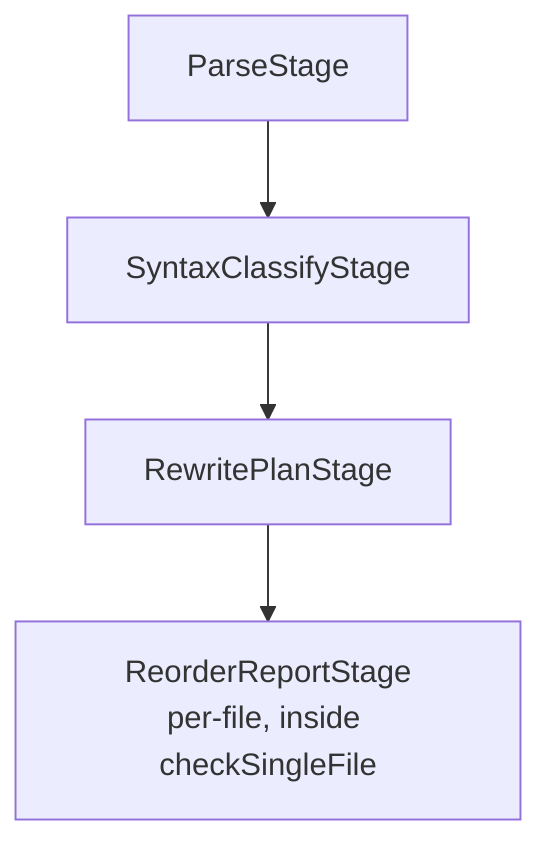
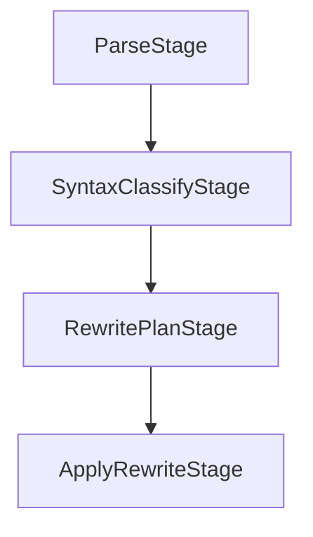
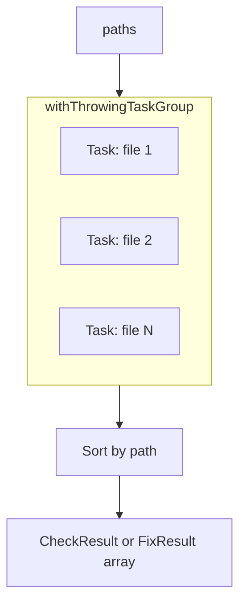

# Pipeline

← [Commands](02-commands.md) | Next: [Stages →](04-stages.md)

---

## Stage Protocol

`Pipeline/Stages/Protocols/Stage.swift`

```swift
protocol Stage<Input, Output>: Sendable {
    associatedtype Input:  Sendable
    associatedtype Output: Sendable
    func process(_ input: Input) throws -> Output
}
```

Every pipeline stage is a stateless `Sendable` value that transforms one `Sendable` type into another. Stages have no side effects and hold no mutable state.

### Composition

```swift
extension Stage {
    func then<Next: Stage>(_ next: Next) -> Pipeline<Self, Next>
        where Output == Next.Input
}
```

`.then(_:)` chains two compatible stages into a new `Stage`. The compiler enforces type-compatibility at the chain boundary.

---

## Pipeline

`Pipeline/Pipeline.swift`

```swift
struct Pipeline<S1: Stage, S2: Stage>: Stage, Sendable
    where S1.Output == S2.Input {

    typealias Input  = S1.Input
    typealias Output = S2.Output

    init(_ first: S1, _ second: S2)
    func process(_ input: Input) throws -> Output
}
```

`Pipeline` is the concrete type produced by `.then(_:)`. It sequences two stages: runs `first`, feeds the result into `second`, and returns `second`'s output. Chains of three or more stages are represented as nested `Pipeline` values.

---

## PipelineCoordinator

`Pipeline/PipelineCoordinator.swift`

```swift
actor PipelineCoordinator {
    init(fileIO: FileIOActor, configuration: Configuration)

    func checkFiles(_ paths: [String]) async throws -> [CheckResult]
    func fixFiles(_ paths: [String], dryRun: Bool) async throws -> [FixResult]
}
```

An `actor` that owns file I/O and configuration, builds stage chains, and processes files concurrently.

### Check pipeline



For each file:
1. Reads source via `FileIOActor`
2. Runs `ParseStage → SyntaxClassifyStage → RewritePlanStage`
3. Maps `[TypeRewritePlan]` → `[TypeReorderResult]` via `TypeReorderResult.init(from:)`
4. Runs `ReorderReportStage` to produce `reportText`
5. Returns `CheckResult`

### Fix pipeline



For each file:
1. Reads source via `FileIOActor`
2. Runs `ParseStage → SyntaxClassifyStage → RewritePlanStage → ApplyRewriteStage`
3. Writes rewritten source back if `modified && !dryRun`
4. Returns `FixResult`

### Concurrency



One `Task` per file. Results are sorted by path before returning, ensuring deterministic output order regardless of task completion order.

---

## CheckResult

`Pipeline/CheckResult.swift`

```swift
struct CheckResult: Sendable {
    let path:        String
    let results:     [TypeReorderResult]
    let needsReorder: Bool
    let reportText:  String
}
```

| Field | Description |
|---|---|
| `path` | Absolute path to the processed file |
| `results` | Per-type reorder analysis |
| `needsReorder` | `true` if any type in the file needs reordering |
| `reportText` | Pre-formatted report string (from `ReorderReportStage`) |

---

## FixResult

`Pipeline/FixResult.swift`

```swift
struct FixResult: Sendable {
    let path:     String
    let source:   String
    let modified: Bool
}
```

| Field | Description |
|---|---|
| `path` | Absolute path to the processed file |
| `source` | Rewritten source text (or original if unchanged) |
| `modified` | `true` if members were reordered |

---

← [Commands](02-commands.md) | Next: [Stages →](04-stages.md)
