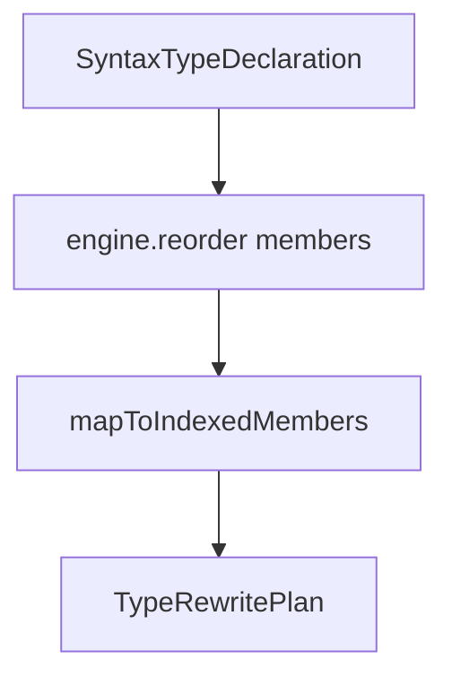

# Stages

← [Pipeline](03-pipeline.md) | Next: [Core Models →](05-core-models.md)

---

## ParseStage

`Pipeline/Stages/Parse/ParseStage.swift`

```swift
struct ParseStage: Stage {
    func process(_ input: ParseInput) throws -> ParseOutput
}
```

Invokes `SwiftParser.Parser.parse(source:)` to build a SwiftSyntax AST from the source string, then creates a `SourceLocationConverter` for line-number resolution.

### ParseInput

```swift
struct ParseInput: Sendable {
    let path:   String
    let source: String
}
```

### ParseOutput

```swift
struct ParseOutput: Sendable {
    let path:              String
    let syntax:            SourceFileSyntax
    let locationConverter: SourceLocationConverter
}
```

---

## SyntaxClassifyStage

`Pipeline/Stages/Classify/SyntaxClassifyStage.swift`

```swift
struct SyntaxClassifyStage: Stage {
    func process(_ input: ParseOutput) throws -> SyntaxClassifyOutput
}
```

Walks the AST with `UnifiedTypeDiscoveryVisitor` (via `forSyntaxDeclarations(converter:)`) to collect every `SyntaxTypeDeclaration` in the file, at any nesting depth.

### SyntaxClassifyOutput

```swift
struct SyntaxClassifyOutput: Sendable {
    let path:         String
    let syntax:       SourceFileSyntax
    let declarations: [SyntaxTypeDeclaration]
}
```

---

## RewritePlanStage

`Pipeline/Stages/Rewrite/RewritePlanStage.swift`

```swift
struct RewritePlanStage: Stage {
    init(engine: ReorderEngine)
    func process(_ input: SyntaxClassifyOutput) throws -> RewritePlanOutput
}
```

For each `SyntaxTypeDeclaration`, feeds its members to `ReorderEngine` and maps the reordered declarations back to `IndexedSyntaxMember` values using name-based matching with duplicate-safe index tracking.

### Member mapping



`mapToIndexedMembers` builds a name-keyed lookup from the original members, then for each reordered `MemberDeclaration` picks the first unused original member with the same name, records its `originalIndex`, and produces an `IndexedSyntaxMember`.

### RewritePlanOutput

```swift
struct RewritePlanOutput: Sendable {
    let path:   String
    let syntax: SourceFileSyntax
    let plans:  [TypeRewritePlan]

    var needsRewriting: Bool { get }
}
```

`needsRewriting` is `true` when at least one plan has `needsRewriting == true`.

### TypeRewritePlan

```swift
struct TypeRewritePlan: Sendable {
    let typeName:         String
    let kind:             TypeKind
    let line:             Int
    let originalMembers:  [SyntaxMemberDeclaration]
    let reorderedMembers: [IndexedSyntaxMember]

    var needsRewriting: Bool { get }
}
```

`needsRewriting` compares `originalMembers` indices to `reorderedMembers.originalIndex` values.

### IndexedSyntaxMember

```swift
struct IndexedSyntaxMember: Sendable {
    let member:        SyntaxMemberDeclaration
    let originalIndex: Int
}
```

Pairs a `SyntaxMemberDeclaration` with the index it occupied in the original member list. Used by `MemberReorderingRewriter` to place each node at its new position.

---

## ApplyRewriteStage

`Pipeline/Stages/Rewrite/ApplyRewriteStage.swift`

```swift
struct ApplyRewriteStage: Stage {
    func process(_ input: RewritePlanOutput) throws -> RewriteOutput
}
```

If `input.needsRewriting` is false, returns the original source unchanged (`modified: false`). Otherwise, creates a `MemberReorderingRewriter` with the plans and rewrites the syntax tree, then serialises the result via `description`.

### RewriteOutput

```swift
struct RewriteOutput: Sendable {
    let path:     String
    let source:   String
    let modified: Bool
}
```

---

## ReorderReportStage

`Pipeline/Stages/Reorder/ReorderReportStage.swift`

```swift
struct ReorderReportStage: Stage {
    func process(_ input: ReorderOutput) throws -> ReportOutput
}
```

Formats `[TypeReorderResult]` as a human-readable multi-line string. For each type it prints the kind, name, and line number, followed by either `[order ok]` with the member list, or `[needs reordering]` with `original:` and `reordered:` sub-lists. Appends a per-file summary line.

### ReorderOutput

```swift
struct ReorderOutput: Sendable {
    let path:    String
    let results: [TypeReorderResult]
}
```

### ReportOutput

```swift
struct ReportOutput: Sendable {
    let path:             String
    let text:             String
    let declarationCount: Int
}
```

---

← [Pipeline](03-pipeline.md) | Next: [Core Models →](05-core-models.md)
