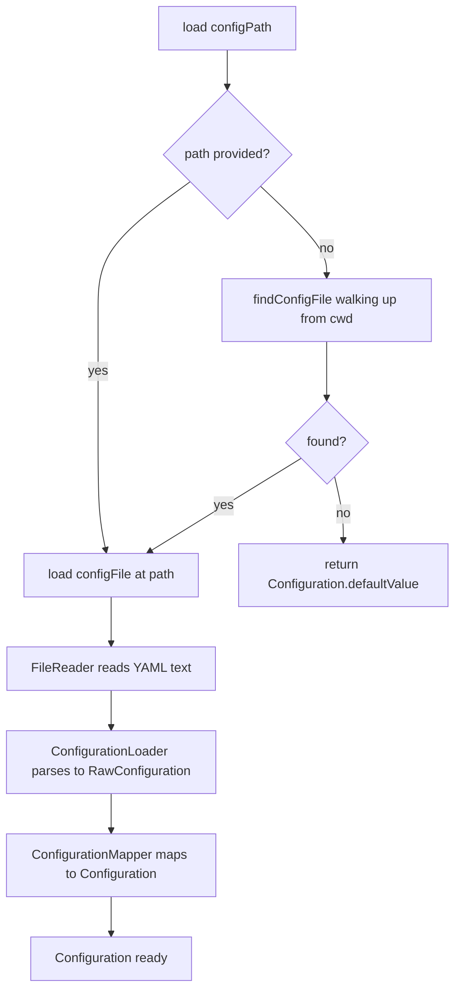

# Configuration

← [Core Models](05-core-models.md) | Next: [Reordering & Rewriting →](07-reordering-rewriting.md)

---

## Configuration

`Core/Configuration/Configuration.swift`

The top-level configuration model. Immutable value type passed through the entire pipeline.

```swift
struct Configuration: Equatable, Sendable {
    let version:             Int
    let memberOrderingRules: [MemberOrderingRule]
    let extensionsStrategy:  ExtensionsStrategy
    let respectBoundaries:   Bool
    let paths:               [String]

    static let defaultValue: Configuration
}
```

| Field | Description |
|---|---|
| `version` | Configuration schema version |
| `memberOrderingRules` | Ordered list of rules evaluated against each member |
| `extensionsStrategy` | How extensions are treated: `separate` or `inline` |
| `respectBoundaries` | Whether `MARK:` comment boundaries are honoured |
| `paths` | Default directories to scan when no files are passed |

`defaultValue` uses `MemberKind.allCases.map { .simple($0) }` as rules, `.separate` strategy, and an empty `paths` array.

---

## ConfigurationService

`Core/Configuration/ConfigurationService.swift`

Orchestrates discovery, reading, parsing, and mapping of the configuration file.

```swift
struct ConfigurationService {
    init(
        fileReader: FileReading      = FileReader(),
        loader:     ConfigurationLoader = ConfigurationLoader(),
        mapper:     ConfigurationMapper = ConfigurationMapper()
    )

    func load(from directory: String? = nil) async throws -> Configuration
    func load(configFile: String) async throws -> Configuration
    func load(configPath: String?) async throws -> Configuration
}
```

### Loading pipeline



`findConfigFile` walks parent directories from the start directory until it either finds `.swift-marshal.yaml` or reaches the filesystem root.

### Three load entry points

| Method | When used |
|---|---|
| `load(configPath:)` | Main entry — used by `resolveCommand`. Dispatches to the other two. |
| `load(configFile:)` | Explicit path provided via `--config` |
| `load(from:)` | Auto-discovery starting from an optional directory |

---

## ConfigurationLoader

`Core/Configuration/ConfigurationLoader.swift`

```swift
struct ConfigurationLoader {
    func parse(_ content: String) throws -> RawConfiguration
}
```

Parses a YAML string into `RawConfiguration` using a custom YAML scanner. Throws a descriptive error when the YAML is malformed or missing required keys.

---

## ConfigurationMapper

`Core/Configuration/ConfigurationMapper.swift`

```swift
struct ConfigurationMapper {
    func map(_ raw: RawConfiguration) -> Configuration
}
```

Converts `RawConfiguration` (stringly-typed) into the typed `Configuration` model. Unrecognised rule strings are silently ignored; unrecognised visibility or method-kind strings fall back to `nil` constraints.

---

## RawConfiguration

`Core/Configuration/RawConfiguration.swift`

Intermediate representation after YAML parsing, before type mapping.

```swift
struct RawConfiguration {
    let version:            Int
    let memberRules:        [RawMemberRule]
    let extensionsStrategy: String
    let respectBoundaries:  Bool
    let paths:              [String]
}
```

---

## RawMemberRule

`Core/Configuration/RawMemberRule.swift`

Represents a single entry under `ordering.members` before it is mapped to `MemberOrderingRule`.

```swift
enum RawMemberRule {
    case simple(String)
    case property(visibility: String?, annotated: Bool?)
    case method(kind: String?, visibility: String?, annotated: Bool?)
}
```

---

## MemberOrderingRule

`Core/Configuration/MemberOrderingRule.swift`

```swift
enum MemberOrderingRule: Equatable, Sendable {
    case simple(MemberKind)
    case property(annotated: Bool?, visibility: Visibility?)
    case method(kind: MethodKind?, visibility: Visibility?, annotated: Bool?)

    func matches(_ member: MemberDeclaration) -> Bool
}
```

Rules are evaluated from most specific to least specific. A member is assigned to the **first** rule that matches it.

| Case | Matches |
|---|---|
| `.simple(kind)` | Any member whose `kind == kind` |
| `.property(annotated:visibility:)` | Instance or type properties, optionally filtered by annotation and/or visibility |
| `.method(kind:visibility:annotated:)` | Instance or type methods, optionally filtered by kind, visibility, and annotation |

`nil` constraint fields act as wildcards.

---

## ExtensionsStrategy

`Core/Configuration/ExtensionsStrategy.swift`

```swift
enum ExtensionsStrategy: String, Sendable {
    case separate = "separate"
    case inline   = "inline"
}
```

---

## MethodKind

`Core/Configuration/MethodKind.swift`

```swift
enum MethodKind: String, Sendable {
    case staticMethod = "static"
    case instance     = "instance"
}
```

Used by `MemberOrderingRule.method` to distinguish between type-level (`static`/`class`) and instance methods.

---

← [Core Models](05-core-models.md) | Next: [Reordering & Rewriting →](07-reordering-rewriting.md)
