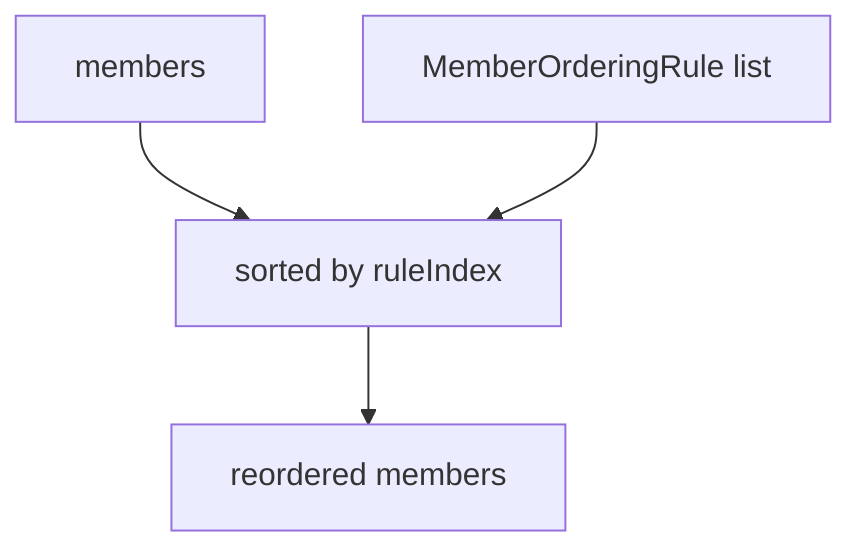
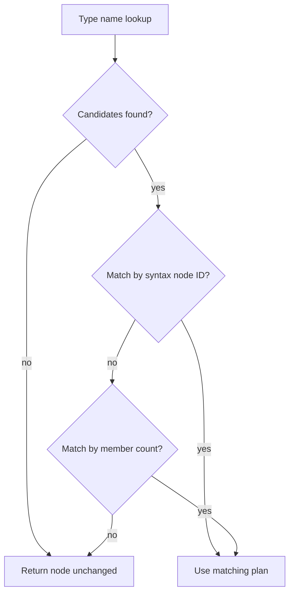
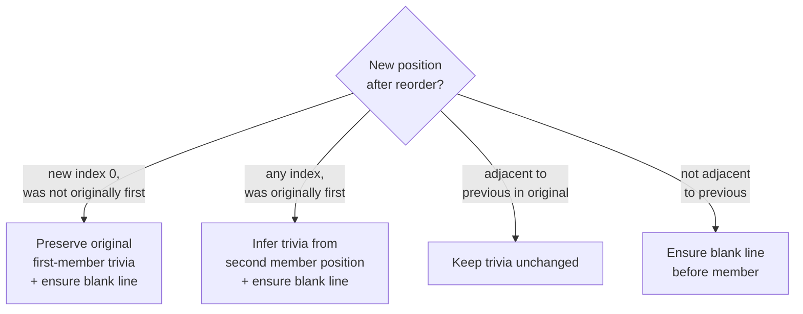

# Reordering & Rewriting

← [Configuration](06-configuration.md) | Next: [Infrastructure →](08-infrastructure.md)

---

## ReorderEngine

`Core/Reordering/ReorderEngine.swift`

A pure, stateless function that sorts `[MemberDeclaration]` according to the active configuration rules.

```swift
struct ReorderEngine {
    init(configuration: Configuration)
    func reorder(_ members: [MemberDeclaration]) -> [MemberDeclaration]
}
```

### Algorithm



`reorder` uses a stable sort. Each member is assigned the index of the **first** rule that matches it. Members matching no rule are placed at `rules.count` (after all explicitly ordered members). Members within the same rule group preserve their relative source order.

```swift
private func ruleIndex(for member: MemberDeclaration) -> Int {
    for (index, rule) in rules.enumerated() where rule.matches(member) {
        return index
    }
    return rules.count
}
```

---

## MemberReorderingRewriter

`Pipeline/Stages/Rewrite/MemberReorderingRewriter.swift`

A `SyntaxRewriter` subclass that physically moves `MemberBlockItemSyntax` nodes in the AST according to `[TypeRewritePlan]`.

```swift
final class MemberReorderingRewriter: SyntaxRewriter {
    init(plans: [TypeRewritePlan])
}
```

At initialisation, plans are indexed by type name for O(1) lookup during tree traversal.

### Visited node types

`MemberReorderingRewriter` overrides `visit` for all five declaration kinds: `StructDeclSyntax`, `ClassDeclSyntax`, `EnumDeclSyntax`, `ActorDeclSyntax`, `ProtocolDeclSyntax`. Each visit delegates to `applyingReorder(to:name:memberBlock:applying:)`.

### Plan matching



1. **By syntax node ID** — verifies that the `MemberBlockItemSyntax` IDs in the member block exactly match those recorded in the plan. This succeeds when the same parse produced both.
2. **By member count** — fallback for re-parsed source, where node IDs differ. Matches if the member block has the same count as the plan.

### Trivia normalisation

Reordering disturbs leading whitespace. The rewriter applies four rules:



Two members are **adjacent** when `originalIndex == previousOriginalIndex + 1`. Non-adjacent moves always receive a blank line separator.

`ensureBlankLine(in:)` checks whether the leading trivia already starts with `\n\n` and inserts a second newline only when it does not.

---

## TypeRewritePlan

`Pipeline/Stages/Rewrite/TypeRewritePlan.swift`

The rewrite specification for a single type, produced by `RewritePlanStage`.

```swift
struct TypeRewritePlan: Sendable {
    let typeName:         String
    let kind:             TypeKind
    let line:             Int
    let originalMembers:  [SyntaxMemberDeclaration]
    let reorderedMembers: [IndexedSyntaxMember]

    var needsRewriting: Bool { get }
}
```

`needsRewriting` is `true` when the sequence of `originalIndex` values in `reorderedMembers` differs from `0, 1, 2, …`.

---

## TypeReorderResult

`Pipeline/Stages/Reorder/TypeReorderResult.swift`

The report model derived from a `TypeRewritePlan`. See [Core Models — TypeReorderResult](05-core-models.md#typereorderresult).

---

← [Configuration](06-configuration.md) | Next: [Infrastructure →](08-infrastructure.md)
