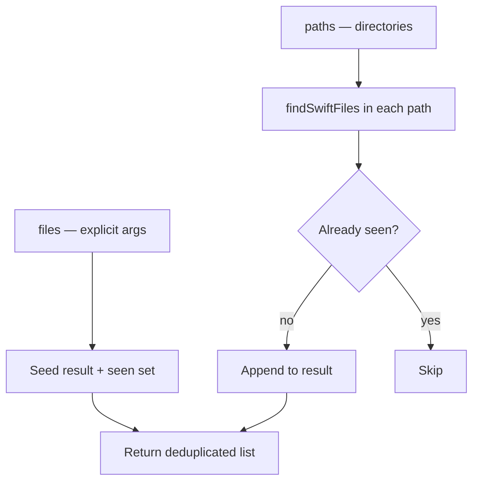
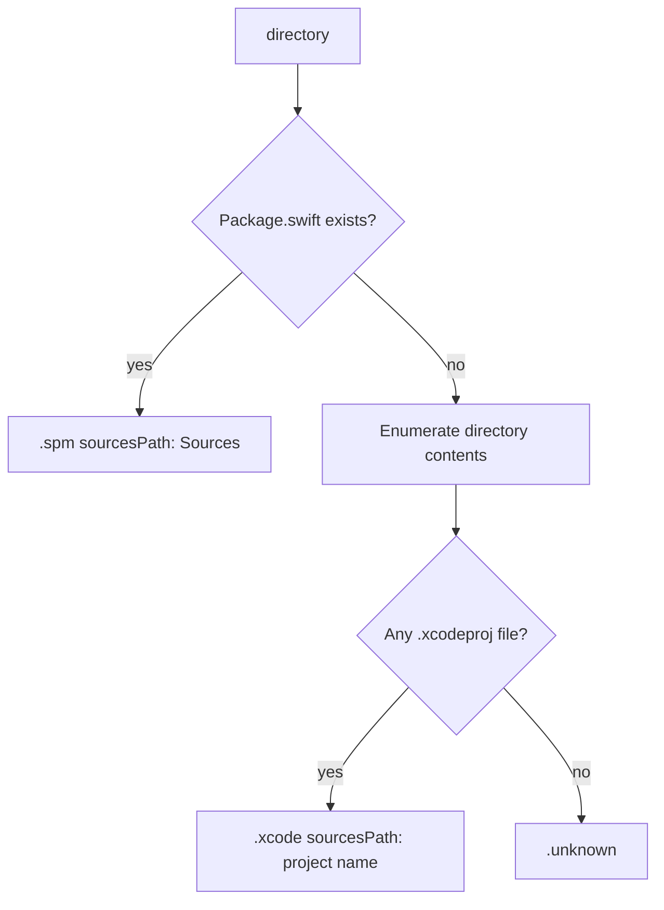
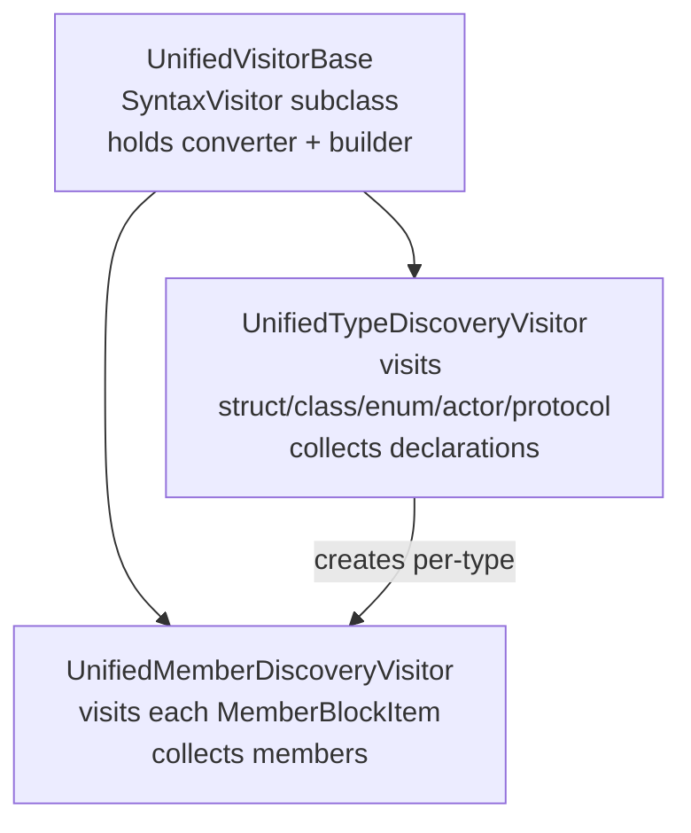

# Infrastructure

← [Reordering & Rewriting](07-reordering-rewriting.md) | [Index](README.md)

---

## FileIOActor

`Infrastructure/Files/FileIOActor.swift`

An `actor` that serialises all file reads and writes, ensuring actor-isolated access to the filesystem during concurrent pipeline execution.

```swift
actor FileIOActor {
    func read(at path: String) throws -> String
    func write(_ content: String, to path: String) throws
}
```

`read` delegates to `FileReadingHelper.read(at:)`. `write` uses `String.write(to:atomically:encoding:)` with `atomically: true`, wrapping errors as `FileWritingError`.

### Supporting types

**FileReader** (`Infrastructure/Files/FileReader.swift`) — a non-actor implementation of `FileReading` used by `ConfigurationService` (synchronous configuration loading does not require actor isolation).

**FileReading** (`Infrastructure/Protocols/FileReading.swift`) — protocol abstraction over file reads, enabling test injection.

```swift
protocol FileReading: Sendable {
    func read(at path: String) async throws -> String
}
```

**FileReadingHelper** (`Infrastructure/Files/FileReadingHelper.swift`) — static helper that reads a UTF-8 file via `String(contentsOfFile:encoding:)` and throws `FileReadingError` on failure.

**FileReadingError** (`Infrastructure/Files/FileReadingError.swift`) — error type for read failures.

**FileWritingError** (`Infrastructure/Files/FileWritingError.swift`) — error type for write failures.

---

## SwiftFileResolver

`Infrastructure/Files/SwiftFileResolver.swift`

Resolves the final list of `.swift` files to process, merging explicit file arguments with directory scans.

```swift
enum SwiftFileResolver {
    static func resolve(files: [String], paths: [String]) -> [String]
}
```

### Algorithm



Explicit `files` appear first, in the order given. Directory-discovered files follow, sorted alphabetically within each path. Deduplication is O(1) via a `Set<String>`.

`findSwiftFiles(in:)` uses `FileManager.enumerator(at:includingPropertiesForKeys:options:)` with `.skipsHiddenFiles`, recursing into all subdirectories and collecting `.swift` files.

---

## ProjectDetector

`Infrastructure/Project/ProjectDetector.swift`

Heuristic detection of the project type in a given directory. Used by `InitCommand` to produce a starter configuration with a sensible `paths:` value.

```swift
enum ProjectDetector {
    static func detect(in directory: String) -> ProjectKind
}
```

### Detection logic



### ProjectKind

```swift
enum ProjectKind: Sendable, Equatable {
    case spm(sourcesPath: String)
    case xcode(sourcesPath: String)
    case unknown
}
```

---

## AST Visitors

The visitor layer sits entirely within `Core/Visitors/` and is only used by `SyntaxClassifyStage`.

### Visitor hierarchy



### UnifiedVisitorBase

`Core/Visitors/UnifiedVisitorBase.swift`

```swift
class UnifiedVisitorBase<Builder: Sendable>: SyntaxVisitor {
    init(sourceLocationConverter: SourceLocationConverter, builder: Builder)
    let sourceLocationConverter: SourceLocationConverter
    let builder: Builder
}
```

Initialised with `viewMode: .sourceAccurate` to ensure trivia is preserved. Provides the `SourceLocationConverter` and generic builder to subclasses.

### UnifiedTypeDiscoveryVisitor

`Core/Visitors/UnifiedTypeDiscoveryVisitor.swift`

```swift
final class UnifiedTypeDiscoveryVisitor<Builder: TypeOutputBuilder>: UnifiedVisitorBase<Builder> {
    private(set) var declarations: [Builder.Output]
}
```

Visits all five type declaration nodes. For each one, creates a `UnifiedMemberDiscoveryVisitor` scoped to that type's `MemberBlock` and records a declaration via the generic `Builder`.

Returns `.visitChildren` so nested types are discovered recursively.

**Factory method:**

```swift
extension UnifiedTypeDiscoveryVisitor where Builder == SyntaxTypeDeclarationBuilder {
    static func forSyntaxDeclarations(
        converter: SourceLocationConverter
    ) -> UnifiedTypeDiscoveryVisitor<SyntaxTypeDeclarationBuilder>
}
```

### UnifiedMemberDiscoveryVisitor

`Core/Visitors/UnifiedMemberDiscoveryVisitor.swift`

```swift
final class UnifiedMemberDiscoveryVisitor<Builder: MemberOutputBuilder>: UnifiedVisitorBase<Builder> {
    private(set) var members: [Builder.Output]
    func process(_ item: MemberBlockItemSyntax)
}
```

Called once per `MemberBlockItemSyntax` via `process(_:)`. Uses a `depth` counter to record only direct (depth-0) members. Nested type declarations at depth 0 are recorded as `.subtype` members; visiting continues into them only to increment `depth` so their inner members are not double-counted.

Handles: `VariableDeclSyntax`, `InitializerDeclSyntax`, `DeinitializerDeclSyntax`, `FunctionDeclSyntax`, `SubscriptDeclSyntax`, `TypeAliasDeclSyntax`, `AssociatedTypeDeclSyntax`, and all five type declaration nodes.

---

## Builder Protocols & Implementations

### MemberOutputBuilder

`Core/Visitors/Builders/MemberOutputBuilder.swift`

```swift
protocol MemberOutputBuilder: Sendable {
    associatedtype Output: Sendable
    func build(from info: MemberDiscoveryInfo, using converter: SourceLocationConverter) -> Output
}
```

### TypeOutputBuilder

`Core/Visitors/Builders/TypeOutputBuilder.swift`

```swift
protocol TypeOutputBuilder: Sendable {
    associatedtype MemberBuilder: MemberOutputBuilder
    associatedtype Output: Sendable
    var memberBuilder: MemberBuilder { get }
    func build(from info: TypeDiscoveryInfo<MemberBuilder.Output>, using converter: SourceLocationConverter) -> Output
}
```

### SyntaxMemberDeclarationBuilder

`Core/Visitors/Builders/SyntaxMemberDeclarationBuilder.swift`

Conforms to `MemberOutputBuilder`. Converts a `MemberDiscoveryInfo` into a `SyntaxMemberDeclaration` by resolving the `AbsolutePosition` to a line number and constructing both the semantic `MemberDeclaration` and the `SyntaxMemberDeclaration` wrapper.

### SyntaxTypeDeclarationBuilder

`Core/Visitors/Builders/SyntaxTypeDeclarationBuilder.swift`

Conforms to `TypeOutputBuilder` with `MemberBuilder == SyntaxMemberDeclarationBuilder`. Converts a `TypeDiscoveryInfo<SyntaxMemberDeclaration>` into a `SyntaxTypeDeclaration`.

---

## Discovery Info Types

Intermediate value types used exclusively inside the visitor layer to carry raw data from a `visit` call to a builder.

### MemberDiscoveryInfo

```swift
struct MemberDiscoveryInfo: Sendable {
    let name:        String
    let kind:        MemberKind
    let position:    AbsolutePosition
    let item:        MemberBlockItemSyntax
    let visibility:  Visibility
    let isAnnotated: Bool
}
```

### TypeDiscoveryInfo

```swift
struct TypeDiscoveryInfo<MemberOutput: Sendable>: Sendable {
    let name:        String
    let kind:        TypeKind
    let position:    AbsolutePosition
    let members:     [MemberOutput]
    let memberBlock: MemberBlockSyntax
}
```

---

← [Reordering & Rewriting](07-reordering-rewriting.md) | [Index](README.md)
